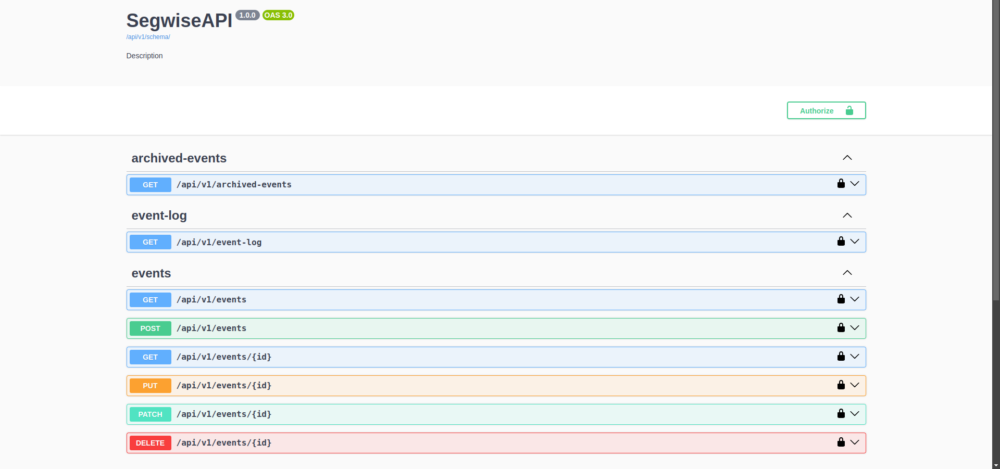

# Segwise Backend Assessment

## Installation and Setup Guide

- Installing Docker and it's repositories

```sh
sudo apt install -y apt-transport-https ca-certificates curl software-properties-common

sudo mkdir -p /etc/apt/keyrings
curl -fsSL https://download.docker.com/linux/ubuntu/gpg | sudo gpg --dearmor -o /etc/apt/keyrings/docker.gpg


echo \
  "deb [arch=$(dpkg --print-architecture) signed-by=/etc/apt/keyrings/docker.gpg] https://download.docker.com/linux/ubuntu \
  $(lsb_release -cs) stable" | sudo tee /etc/apt/sources.list.d/docker.list > /dev/null

sudo apt install docker.io
sudo apt install docker-compose
```

- Verify installation

```sh
docker --version
```

- Managing Docker as NON-ROOT User

```sh
sudo usermod -aG docker $USER

newgrp docker
```


- Enable and start docker
```sh
sudo systemctl enable docker
sudo systemctl start docker
```


## Cloning Repo of APP

```sh
git clone https://github.com/siddharth12s/segwise.git
```

- Change directory to segwise (Project folder)

```sh
cd segwise
```

## Create Configs.py (Environment variables file)

```sh
sudo nano configs.py
```

- COPY-PASTE the following database CONFIG in the FILE

```python3
DATABASES = {
    "default": {
        "ENGINE": "django.db.backends.postgresql",
        "NAME": "segwise_db_2",
        "USER": "segwise_user",
        "PASSWORD": "password",
        "HOST": "postgres",  # Docker Image
        # "HOST": "127.0.0.1", # For local
        "PORT": "5432",
    }
}
```

## Run the DOCKER

```sh
docker-compose build
```

```sh
docker-compose up
```


### APP Interface

- Go to http://0.0.0.0:8000/api/v1/docs for checking out the OpenAPI Schema



## Live APP 
- url :-  http://3.80.85.23:8000/api/v1/docs/


### Costing

- I'm using Amazon EC2 t2.micro instance which comesup with 750 free hours.

- So, for 30 * 24 or 31 * 24 = 720 to 744 hours the effective cost would be 0$, even for 5 API requests/day. 

### RESOURCES used
- ChatGPT, Stackoverflow
- https://www.django-rest-framework.org/api-guide/generic-views/
- Reddit for Docker queries and deployment.


### Additional Features

- Added JWTAuth for the API services


- User creation endpoint
